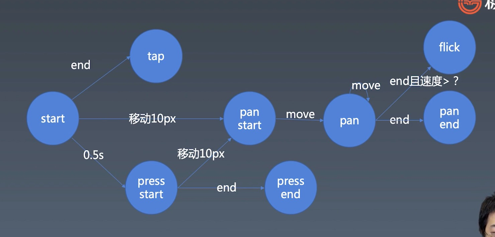

# 组件化

## 对象与组件

### 对象

```
properties
Methods
Inherit
```

### 组件

```
...对象
Attribute
Config & State
Event
Lifcycle
Children
```

Attribute 与 Property

### 如何设计组件状态

组件会因为用户的外界输入而改变当前状态，所以要通过状态管理实时同步组件的当前状态，避免多次反复操作引起的状态不一致问题

### 搭建基本 jsx 运行框架

createElement Component ElementWrapper TextWrapper

### Carousel

通过 render 渲染图片

### TimeLine && Animation

1、使用 Symbol 定义属性，目的是唯一的标识，定义出来的属性不会被常规获取属性的方法获取到，适合定义一些非私有的、但又希望只用于内部的方法或者属性。

### gesture
对基本手势进行处理并归类为不同的手势事件


