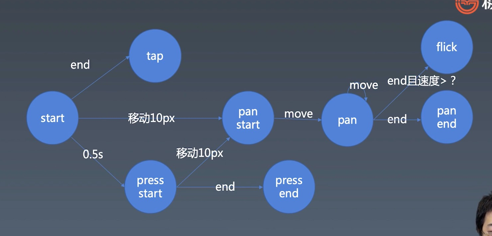

# 组件化

## 对象与组件

### 对象

```
properties
Methods
Inherit
```

### 组件

```
...对象
Attribute
Config & State
Event
Lifcycle
Children
```

Attribute 与 Property

### 如何设计组件状态

组件会因为用户的外界输入而改变当前状态，所以要通过状态管理实时同步组件的当前状态，避免多次反复操作引起的状态不一致问题

### 搭建基本 jsx 运行框架

createElement Component ElementWrapper TextWrapper

### Carousel

通过 render 渲染图片

基本实现手动拖拽切换图片以及setIntever自动轮播

### TimeLine && Animation

1、使用 Symbol 定义属性，目的是唯一的标识，定义出来的属性不会被常规获取属性的方法获取到，适合定义一些非私有的、但又希望只用于内部的方法或者属性。

2、定义基本动画对象`Animation`
通过`TimeLine`管理并播放Animation对象
可实现动画暂停、继续、重置等css无法实现的操作

### gesture
对基本手势进行处理并归类为不同的手势事件


通过`mouse`和`touch`事件来实现`tap`、`pan`、`swipe`、`press`等手势事件

### 完善Carousel

通过js动画库以及手势库，将手动拖拽切换与自动轮播时间结合，健壮Carousel组件

通过`triggerEvent`事件传递组件消息，让组件有了和外接交互的能力

### 实现Button组件及List组件

`Button`中介绍了组件嵌套简单子组件文本的情况

`List`组件中介绍了jsx如何循环创建子组件，主要借由`template`实现循环创建逻辑

